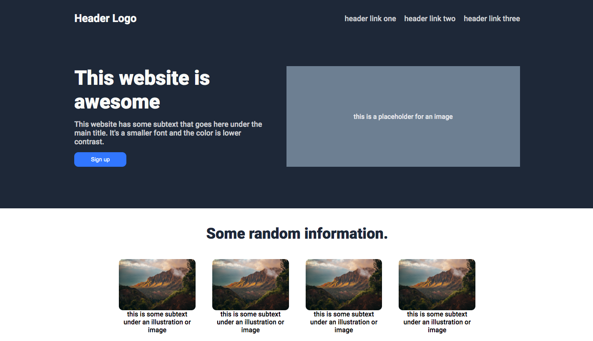
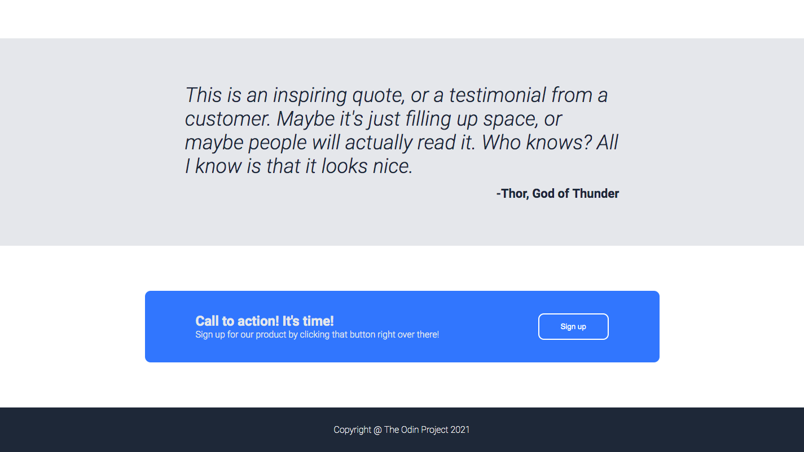

# Landing page project

This project involves the creation of a landing page from scratch, using a design provided by The Odin Project. It will use HTML and CSS, in order to put together all of the skills developed up until this point.

## Phase 1 : creating the desired design

I spent the first day getting my webpage as close to the desired design as possible. Styling the first section as closely as possible to the requested design was the most time-consuming part of the process, but I found that it made the rest of the sections much easier and faster to style and finish. 

Here are screen captures of the webpage after this first day : 

## Phase 2: personalisation of first section

After finishing the first version of the webpage, I decided to try to modify the landing page into something more personal, both to make it more fun to work on and to get better at handling the tools used for web design. I settled on a half-satirical imaginary "BJJ Support Group".

The second day was spent changing up the first section, modifying the HTML to fit the bill of the "support group" as well as the CSS to add a suitable logo, add some interactivity in the links and buttons, and make the first section span the entirety of the visible screen. 

The biggest challenge I came across was making sure the webpage would look okay if the window was reduced or if a zoom were applied - there were some strange results when trying to implement the full-screen capability. It took some trial and error, but the page finally looks alright when the window screen is modified (it is yet to work well with a phone screen, but I hope to fix this in the future.) 

Next up would be modifying the other sections, but this first section required the most modifications on the CSS aspect, so the others will likely be a matter of changing the HTML and tampering with scaling.